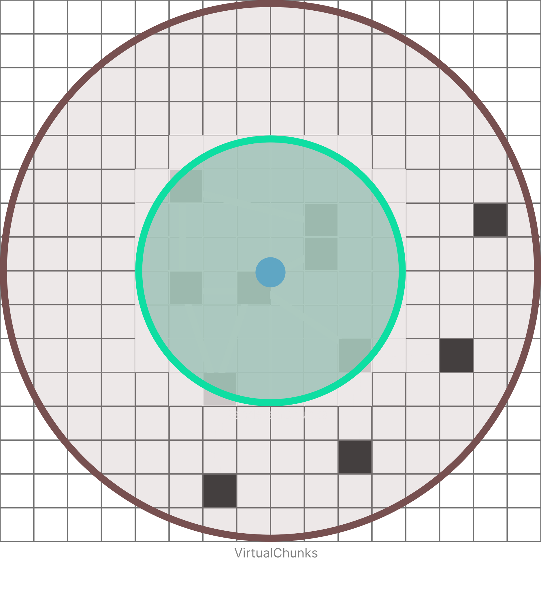
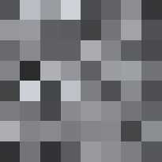
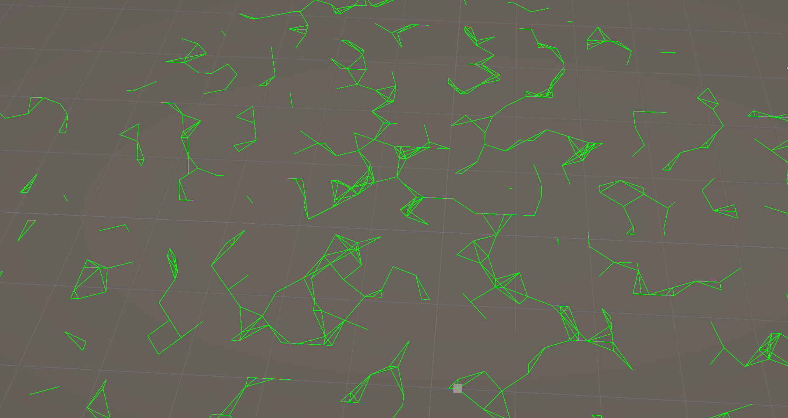
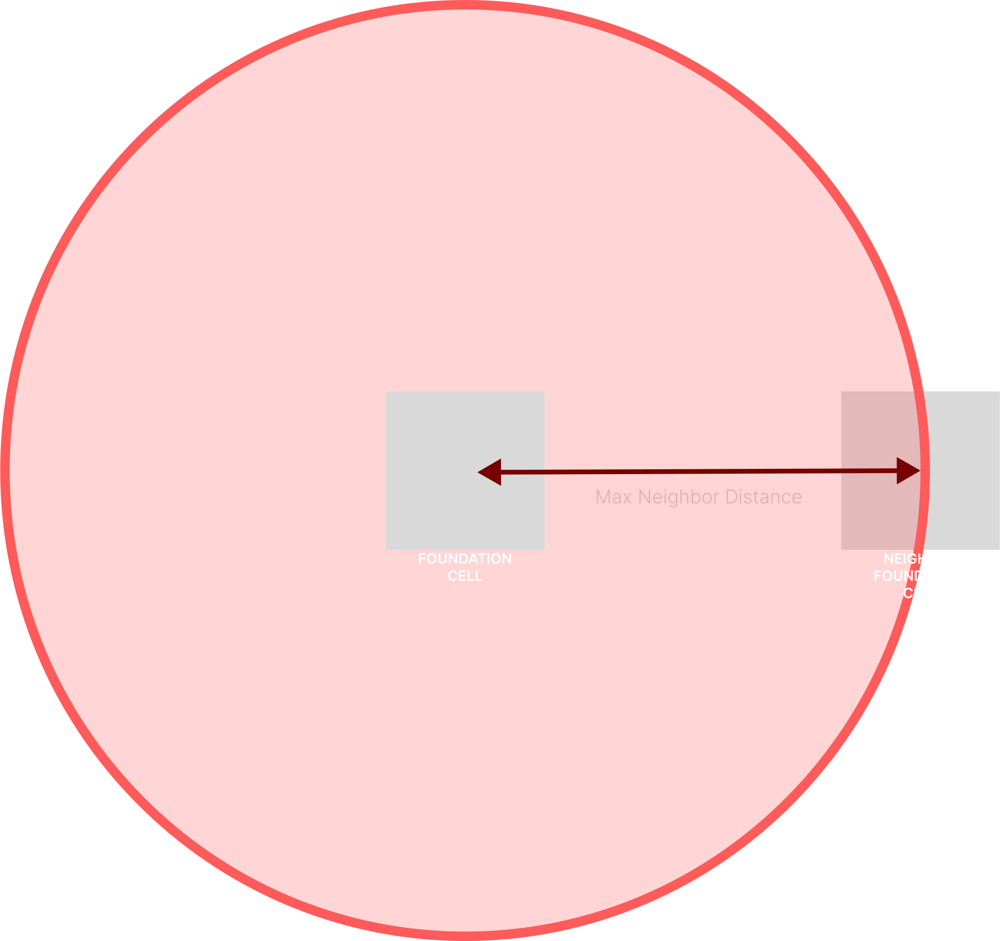
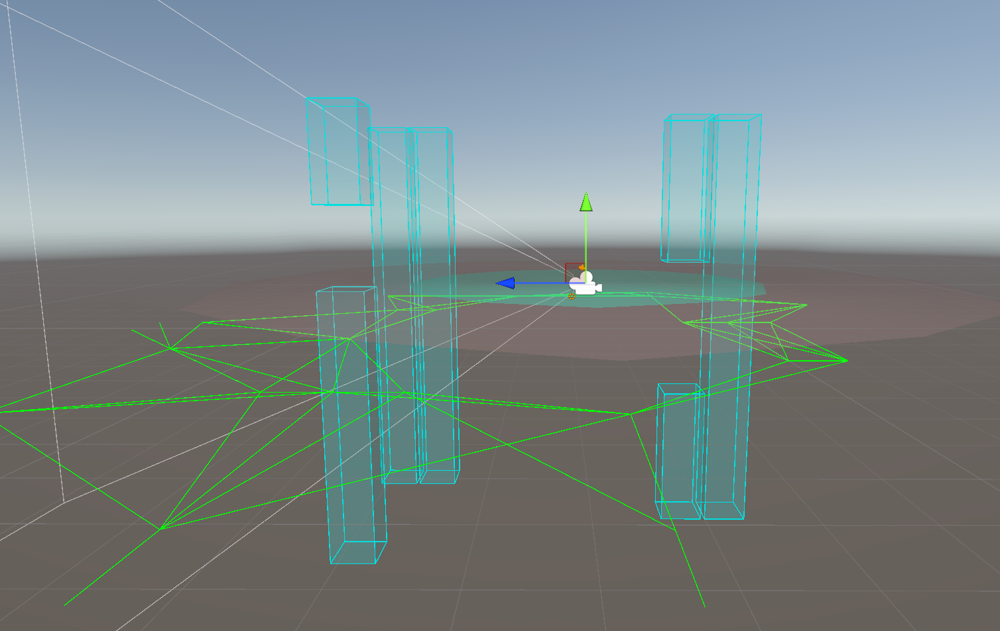

# **City generation - Unity**

## Summary
- [About the project](#about-the-project)
- [Features](#features)
- [Algorithm explanations](#algorithm-explanations)
- [In the future](#in-the-future)
- [Credit](#credit)

# About the project
This project is a proof of concept of a procedural world generation algorithm based on the **BLAME!** universe.

# Features
* Chunk loading/unloading system
* Fully deterministic generation
* Building generation
* Neighbor graph
* Bridge generation

# Algorithm explanations

## Cell generation
The project started by imagining the process of the generation and by etablishing the different steps of the algorithm.

To facilitate the development of the algorithm, the generation of buildings is based on a grid where each cell has the same size.

The camera of the player is a chunk loader which loads the region of the world around it. Before being rendered each cell must be precomputed, the cells are considered `virtual`. When they are close enough from the player they are considrer `loaded` (or `rendered`).

*Diagram of the chunk regions around the player (in  blue).*

To generate the position of buildings a noise map is used. The coordinates located around the player are circularly scanned. When the noise value at some coordinates reaches an arbitrary threshold, a cell is filled with a building.

*Generation of the cells using a perlin noise.*

*Exaggeration of the type of map used.*

## Cell unloading

Since the loading/unloading process only happens on the circle around the player, sometimes when the chunk loader moves too fast, the region the player left is not unloaded properly.

To fix this issue, when the player moves the part that is outside of the virtual radius and that is not in the new one is unloaded. The scan is made in a square to facilitate the unloading.

*Portions of the region which are unloaded (in red).*

*Statistics of the cell generation and destruction.*

## Neighborhood generation

Since the bridges link two close buildings together, to instantiate them a neighborhood between the buildings must be computed. 

*Graph of the neighborhood (with hidden buildings).*

When a virtual cell is loaded, each of the cell around it is circularly scanned to search for a neighbor in a certain radius.

*Neighborhood without building unloading.*

*Neighborhood generation with dynamic building unloading.*

## Building division

To have an environment that seems more organic, buildings can be split into two parts. To do this when generating a building two other noise values ​​are calculated to know the height of the top and bottom part, if those complete the entire building then only one part is instantiated.

*Dynamic generation of cells made of two distinct meshes.*

## Bridges spawn rate and height

To have bridges that spawn at a certain rate and to keep a deterministic approach, the instantiation of a bridge is based on the coordinates of its two owners and the floor number. These values ​​are converted to a hashcode, then this hashcode is converted to a boolean using perlin noise and a threshold.

*Dynamic generation of floor based bridges.*

## Wall module generation

In order to have less repetitiveness in buildings, a modular wall system has been developed, each of the modules is chosen according to the building coordinates, the local coordinates of the module and its orientation which are hashed. Then, these modules are merged into a single mesh.

Because Unity does not support combined meshes with multiple materials, there are as many different materials as there are meshes, each mesh is associated with a material.

*Dynamic generation of wall modules.*

## Final result 

# In the future
In the future this project will be ported to Unreal Engine 5. Most of the generation steps will be asynchronous and the bridge generation will be cleaned up. Then, a proper gameplay will be implemented.

# Credit
- Rémi GINER
- Noé MOUCHEL
